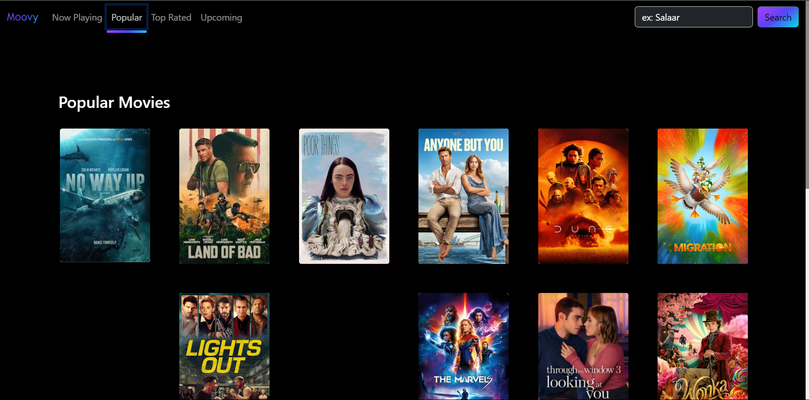
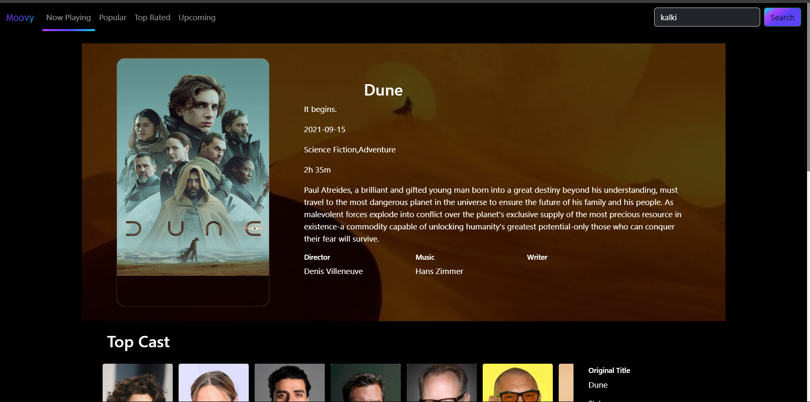
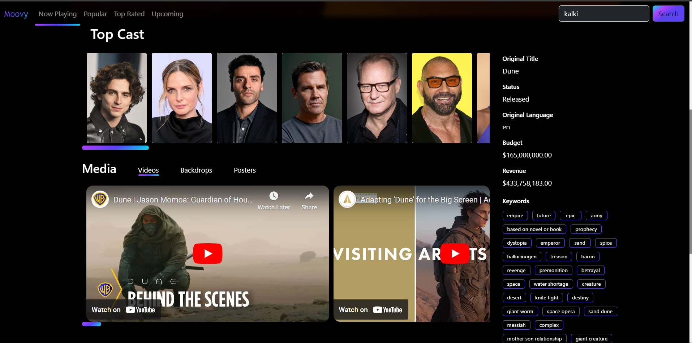
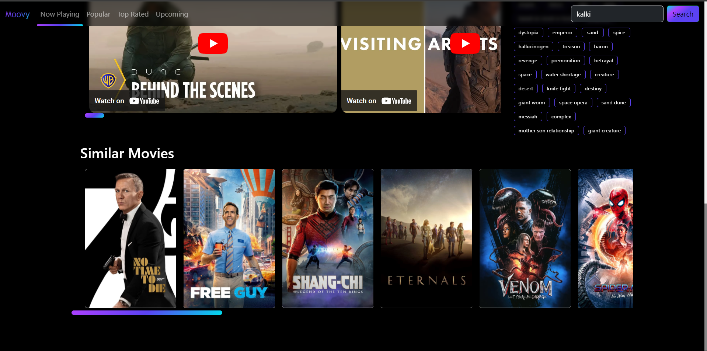

# Movie App

## Overview

This Movie App is a web application built using React that allows users to explore and discover information about movies. It utilizes The Movie Database (TMDb) API to fetch movie data.

## Live Demo

- **Note**: Use VPN (TMDB server in india sometimes goes down)
- Check out the live demo of the Movie App: [Live Link](https://react-movie-app-one-omega.vercel.app/)

## Features

- **Browse Movies:** Explore movies based on different categories such as Now Playing, Popular, Top Rated, and Upcoming.
- **Search:** Search for movies using keywords and get relevant results.
- **Movie Details:** View detailed information about a specific movie, including cast, crew, release date, and overview.
- **Responsive Design:** (not responsive)

## Technologies Used

- React
  
- JavaScript
  
- Vite
  
- CSS
  
- React Router
- TMDb API

## How to Run

1. Clone the repository: `git clone https://github.com/genial-mani/react-movie-app.git`
2. Navigate to the project directory: `cd react-movie-app`
3. Install dependencies: `npm install`
4. Start the application: `npm run dev`
5. Open your browser and visit `http://localhost:5173` or click on the link in the console.
6. If you can't see any data on the screen then use any VPN so that TMDB server can be accessed.

## API Key

In order to fetch movies data, TMDB api key is used.

## Screenshots

## Acknowledgements

- [React](https://reactjs.org/)
- [React Router](https://reactrouter.com/)
- [The Movie Database (TMDb)](https://www.themoviedb.org/)
- [React Spinners](https://www.npmjs.com/package/react-spinners)

`Star the repo if u like the project.`
